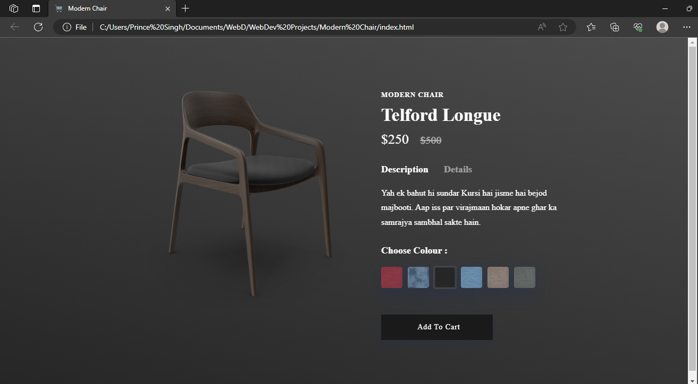
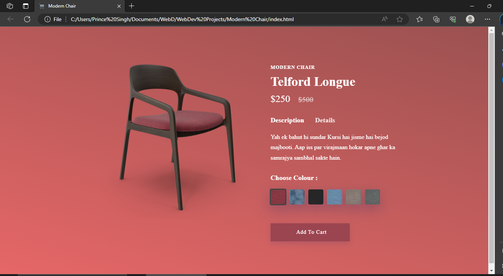
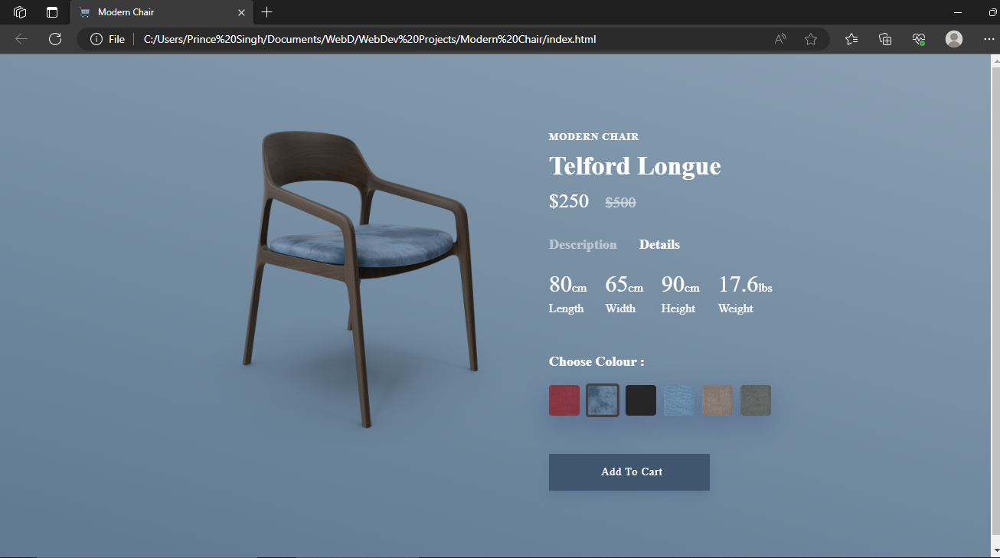
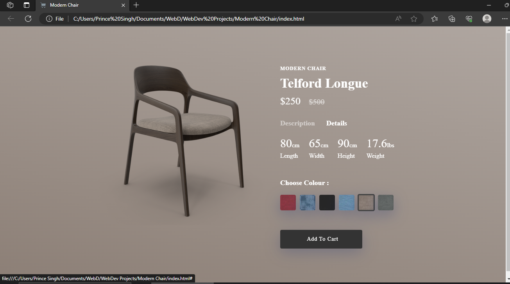

<h1>Modern chair Project using CSS Animations</h1>

Click Below Link to see Deployment ⬇ 

Github Pages Link : <a href="https://princepsr.github.io/WebDev_Projects/Modern Chair" target="_blank"> Modern Chair</a>

### First Page &darr;

 

### Color 2 &darr;

 

### Color 3 &darr;

 

### Color 4 &darr;

 