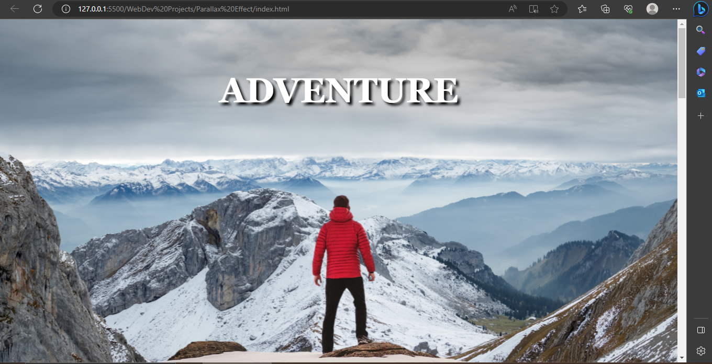
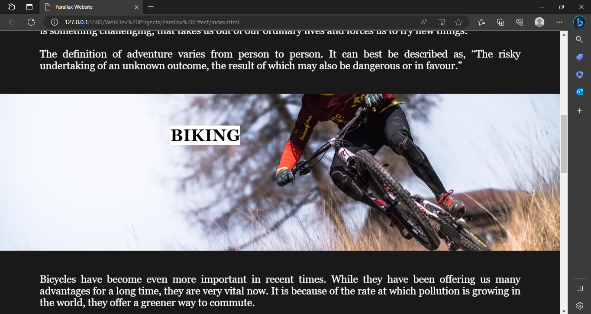
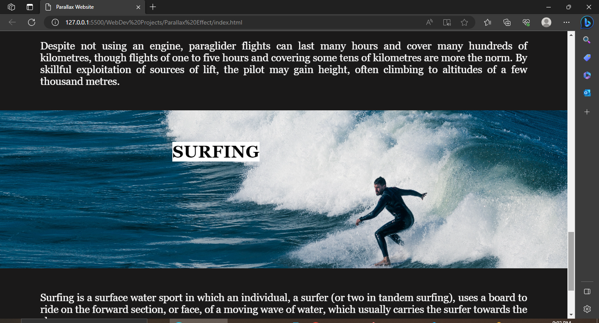

<h1>3D Parallax Effect created using CSS</h1>

Click Below Link to see Deployment ⬇ 

Github Pages Link : <a href="https://princepsr.github.io/WebDev_Projects/Parallax Effect" target="_blank"> Parallax Effect</a>

### Header &darr;

 

### 3D Parallax;

 

### Parallax1;

 

### Parallax2 &darr;

 
