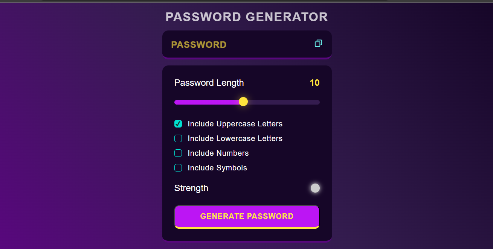
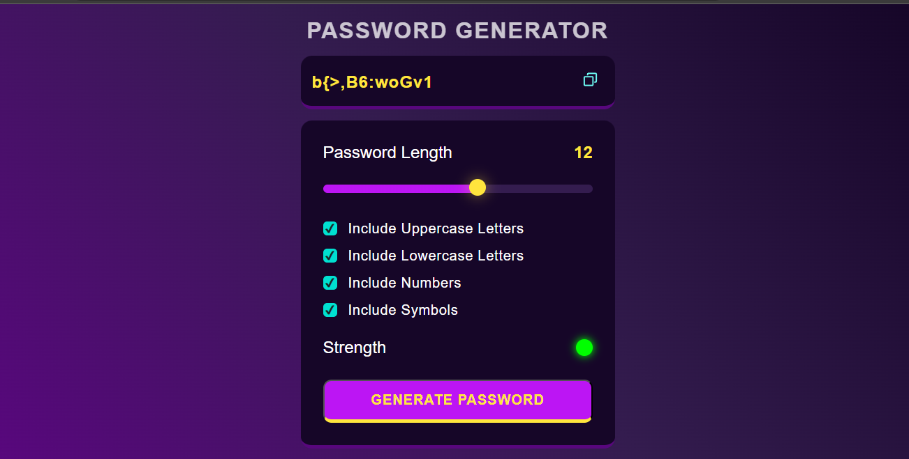
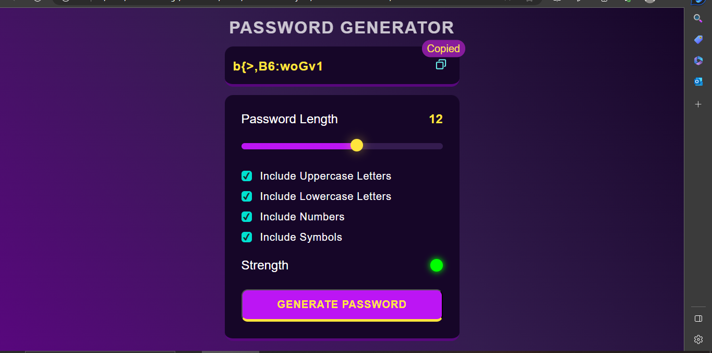
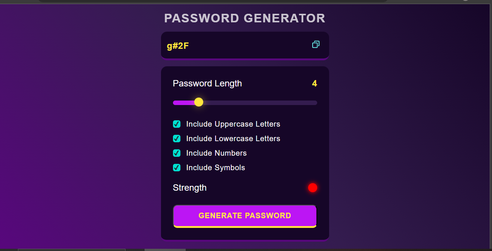

<h1>Password Generator using HTML,CSS and JS</h1>

Click Below Link to see Deployment ⬇ 

Github Pages Link : <a href="https://princepsr.github.io/WebDev_Projects/Password Generator" target="_blank">Password Generator</a>

### Password 1 &darr;

 

### Password 2 &darr;

 

### Password 3 &darr;

 

### Password 4 &darr;

 