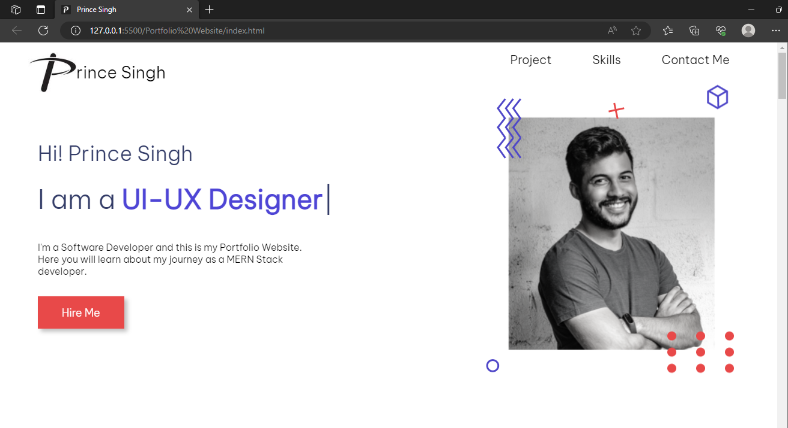
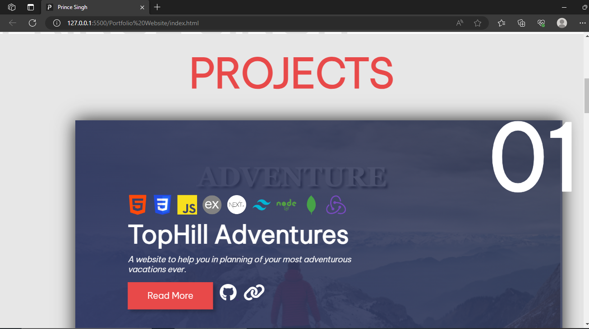
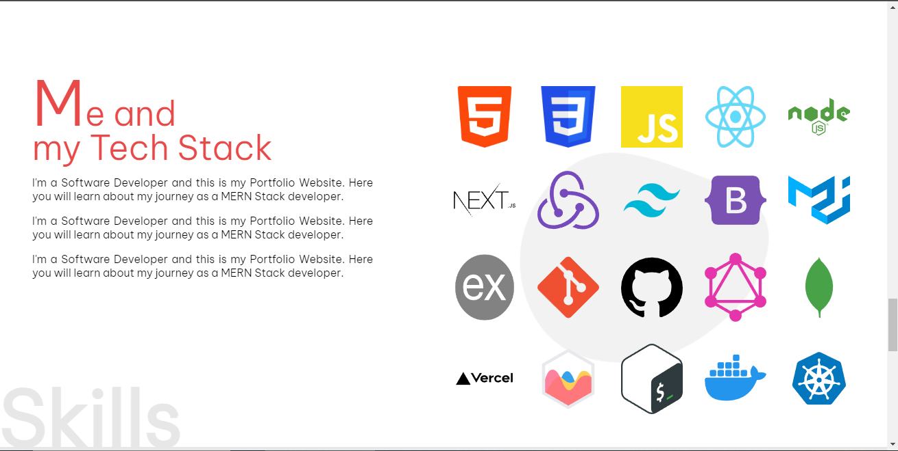
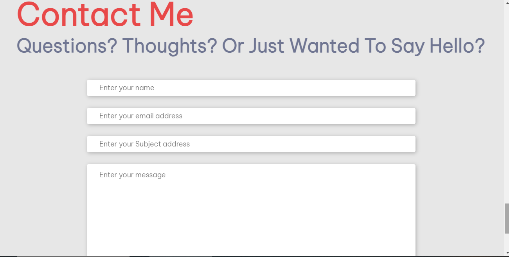

<h1>Portfolio Website using CSS</h1>

Click Below Link to see Deployment ⬇ 

Github Pages Link : <a href="https://princepsr.github.io/WebDev_Projects/Portfolio Website" target="_blank">Portfolio Website</a>

### Hero Section &darr;

 

### Projects &darr;

 

### TechStack &darr;

 

### Contact &darr;

 