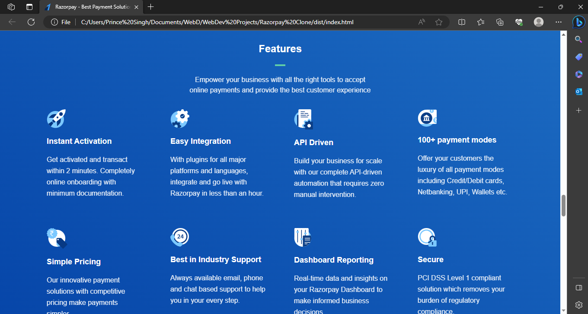
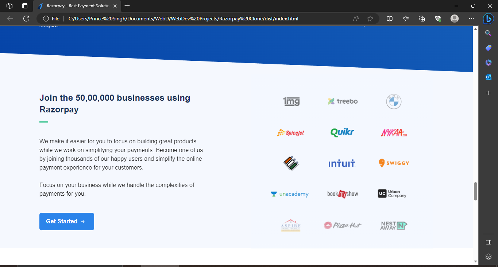
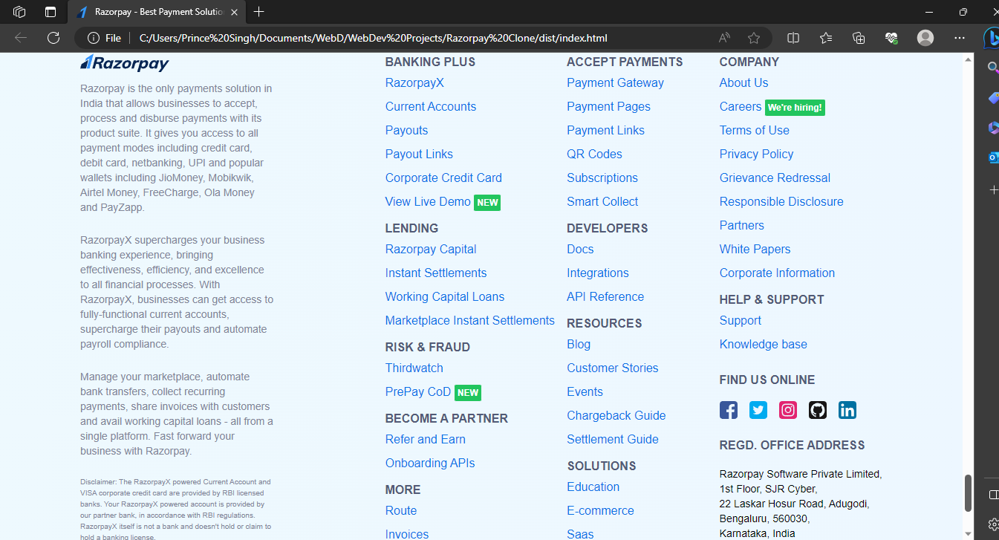

How to setup the Tailwind Project?
1. Initialise the newly created folder using npm init
2. Install vite using npm i vite
3. Run npm install -D tailwindcss postcss autoprefixer
4. Initialise Tailwind using npx tailwindcss init
5. Setup the postcss.config tailwind.config main.css same as provided.

<h1>Portfolio Website using Tailwind CSS</h1>

Click Below Link to see Deployment ⬇ 

Github Pages Link : <a href="https://princepsr.github.io/WebDev_Projects/Razorpay Clone/dist" target="_blank">Razorpay Clone</a>

### Hero Section &darr;

 

### Section1 &darr;

 

### Section2 &darr;

 

### Section3 &darr;

 

### Section4 &darr;

 

### Section5 &darr;

 

### Footer &darr;

 