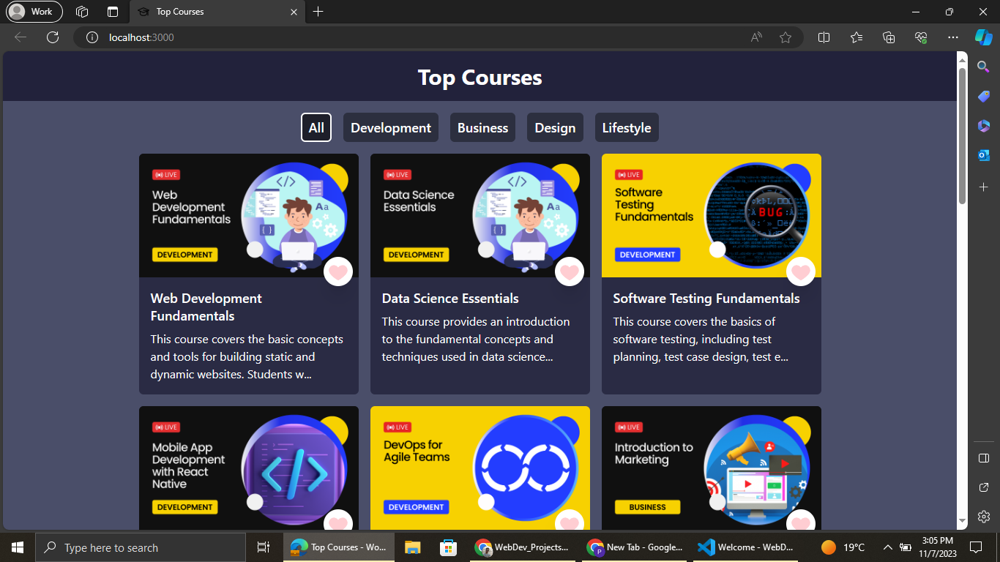
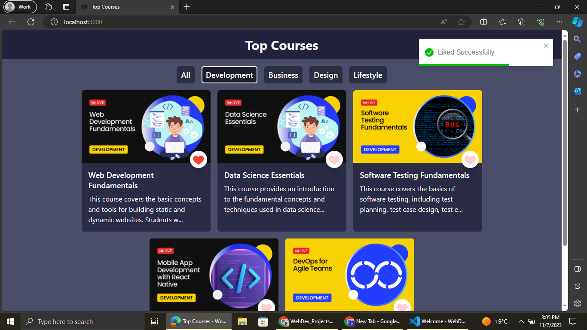
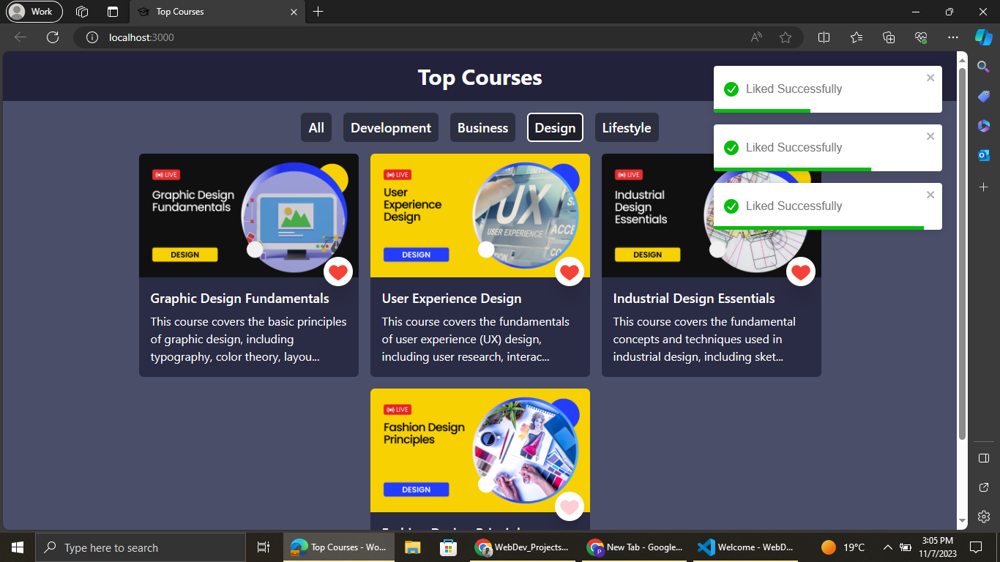
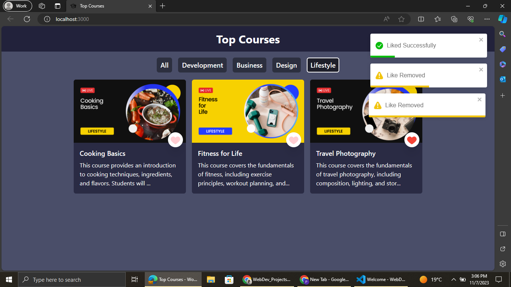

This Project demonstrates usecase of react Hooks(useState and useEffect)

How to setup the React App?
1. Install necessary node packages by running npm install
2. Run npm start to start the server

<h1>Top Courses using ReactJS and Tailwind</h1>

Click Below Link to see Deployment ⬇ 

Github Pages Link : <a href="https://princepsr.github.io/WebDev_Projects/Top Courses/build" target="_blank">Top Courses</a>

### Hero Section &darr;

 

### Development Section &darr;

 

### Design Section &darr;

 

### Lifestyle Section &darr;

 