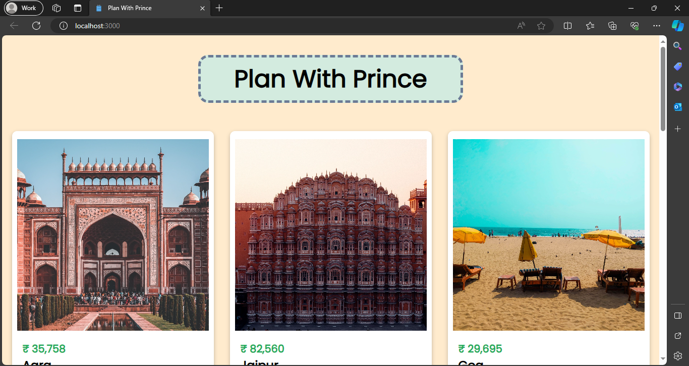
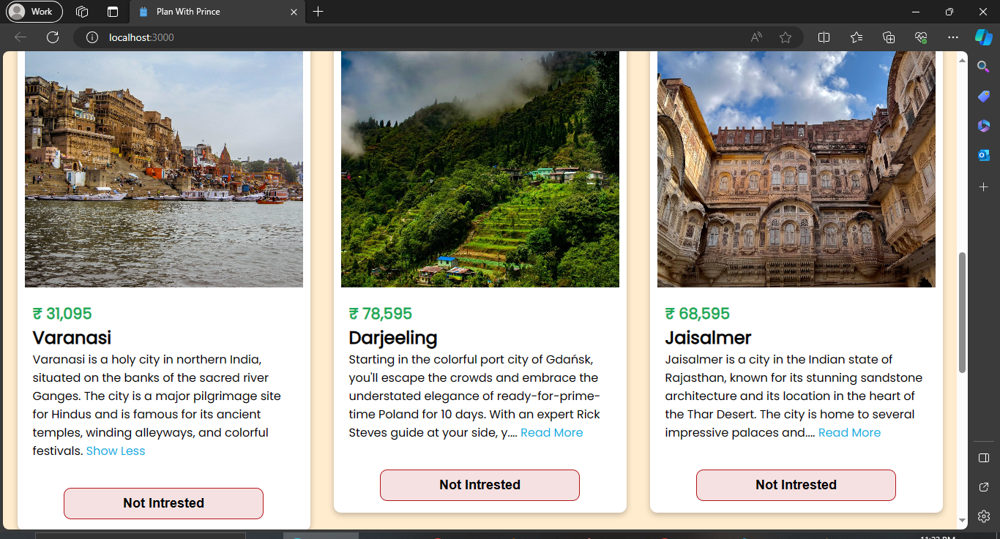
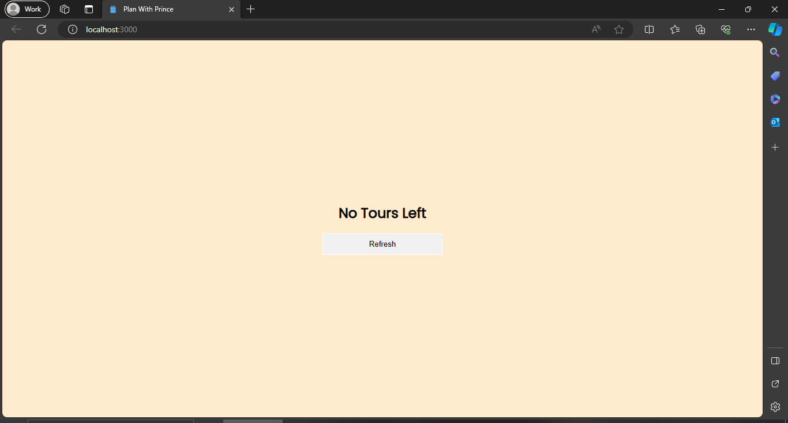

How to setup the React App?
1. Install necessary node packages by running npm install
2. Run npm start to start the server

<h1>Tourism Planner using ReactJS</h1>

Click Below Link to see Deployment ⬇ 

Github Pages Link : <a href="https://princepsr.github.io/WebDev_Projects/Tourism Planner/build" target="_blank">Tourism Planner</a>

### Hero Section &darr;

 

### Tour Cards &darr;

 

### Refresh Page;

 